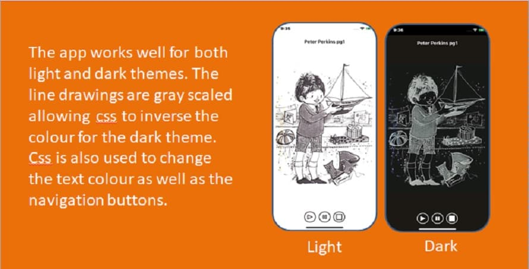

# An Audio Story PWA
This text to speech audio story is a Progressive Web App

## Features

This demo is written in HTML, CSS and vanilla Javascript. It has no dependencies. The line-drawings are stored as a gray scale and compressed to webp format that is supported by major browsers. The navigation buttons are svg graphics. The audio text is hidden by the css tag "display: none;". The default voice is selected for Android but had to be hard coded for Apple devices.

## Demo

https://mobilefirstdesign.github.io/stories/

## Browser Compatibility

The Peter Perkins PWA has been tested in the following browsers:

* Chrome 93 (Windows and Android)
* Firefox 92
* Safari 14.8
* Edge 93
